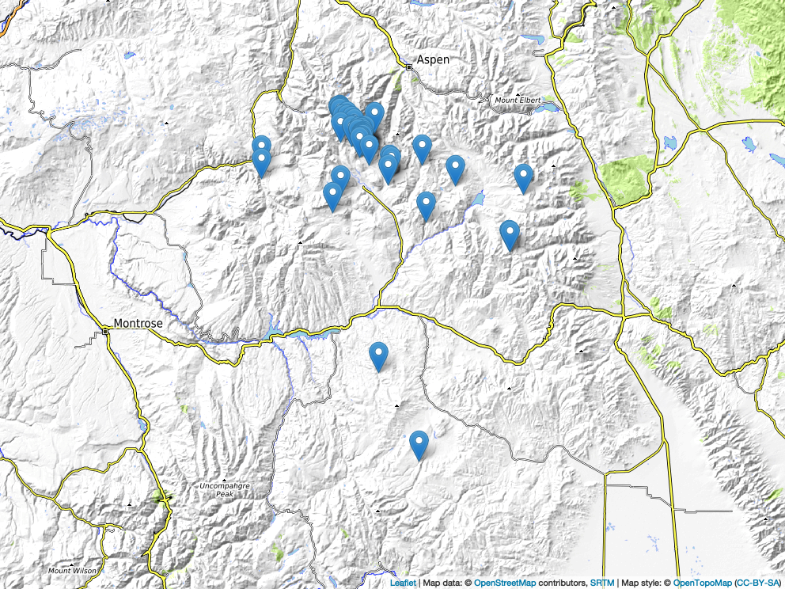

RMBL survey marks for RTK GNSS
================

> DISCLAIMER: All data provided here, including coordinates of survey
> marks, are provided “as-is” and without any warranty of accuracy. The
> data and associated physical markers are shared exclusively for
> non-commercial research purposes to scientists at the Rocky Mountain
> Biological Laboratory and are categorically unfit for any other use
> (including, but not limited to, professional land surveying). Please
> refer to the [Colorado State Board of Licensure for Architects,
> Professional Engineers and Professional Land
> Surveyors](https://dpo.colorado.gov/AES) for information on
> professional land surveying and a directory of professional land
> surveyors licensed to conduct such work in Colorado.

## Background

Signals sent from GNSS satellites experience distortion as they pass
through the atmosphere. Sub-foot and centimeter positioning with a GNSS
receiver requires correcting for these distortions. This can be achieved
in real-time (vs. post-processing) by sending corrections from a GNSS
receiver placed at a known point (the “base” unit) to a second GNSS
receiver that is moved around to collect data or re-find previously
mapped positions (the “rover” unit). Because the base is stationary, any
apparent changes in its measured position must be from atmospheric
distortions. A nearby rover will experience a very similar set of
atmospheric distortions, so it can correct its own position by using a
constant stream of deviation measurements sent to it from the base,
typically via an internet connection or a local radio signal.

Survey marks are most useful when position corrections are needed in
real-time and internet connectivity is not available. Survey marks
provide a stable point that can be re-found and reused repeatedly as the
known location for a GNSS receiver to act as a base for nearby rovers.
New marks established for real-time kinematic mapping should be
established with care to ensure that the mark won’t move, that its
position can be measured with high precision, and that a base unit
placed there can be “seen” by a rover unit across the entirety of the
area to be mapped.

Emlid provides a brief overview and animation demonstrating how RTK
works
[here](https://docs.emlid.com/reachrs2/rtk-quickstart/rtk-introduction/).

## Overview of existing marks

<figure>

<figcaption aria-hidden="true">Overview map of all survey mark
points.</figcaption>
</figure>

## Choosing an existing survey mark for your research site

Four questions are useful when choosing a survey mark to use as a
real-time base location:

1.  How far is the proposed survey mark/base location from the mapping
    site? The distance between a base unit and the rover (the
    “baseline”) must be short enough to reliably send corrections over
    radio. Currently, LoRa is the most common between unit radio
    protocol. The transmission power is low and has a nominal range on
    the scale of a few kilometers (e.g., 8 km for Emlid RS2+). This
    range can be boosted with better antennas, signal repeaters, or
    different/more powerful radios (FCC license likely required!).

Additional problems arise with long baselines because the satellite
signals received by the base and rover may experience different
distortions if they pass through different parts of the atmosphere. The
loss of precision will typically be on the order of a few parts per
million. For example, an RTK setup with a 6 ppm loss of precision and a
12 km (7.5 mile) baseline will have an additional 72 mm (2.8 inch) error
on top of the unit’s nominal positional error. A heuristic limit is to
keep the baseline \<10 km (6.2 miles) for GNSS receivers that only use
the L1 signal band and \<60 km (37 miles) for L1/L2/+ multi-band
receivers
[(source)](https://docs.emlid.com/reachrs2/rtk-quickstart/rtk-introduction#single-band-and-multi-band-receivers),
although the precision tolerances of your project may dictate more
stringent limits.

2.  Is there a clear line-of-sight between the survey mark and the
    entire area to be mapped? Radio waves of the frequencies typically
    used for communication between GNSS receivers cannot pass through
    obstacles like dense forests and mountains very well–they are
    absorbed or they are reflected. Radio wave propagation in complex
    field environments is very challenging to predict. A useful
    heuristic is to use the line-of-sight rule: if the base and rover
    antennas can “see” each other and are within their nominal range, a
    radio signal should reliably pass between them. This repository
    contains [line-of-sight viewsheds](2023_mark-viewsheds.geojson) for
    an 8 km radius around each survey mark. These represent *estimates*
    of where a pair of Emlid RS2 GNSS receivers could communicate using
    their out-of-the-box configuration. They are intended to aid in
    planning, and they should be validated in the field prior to
    operational use.

3.  Is the survey mark suitable for the mapping application? Survey
    marks in this database vary tremendously in…

- Accessibility from roads/trails: Accessibility can be a positive if it
  means that it’s easier for your field crew to get a base receiver set
  up on the survey mark. Accessibility can become a liability if it
  means that you have to leave GNSS equipment unattended in a high
  traffic area where it is prone to disturbance from curious passersby
  or, worse, theft.

- Stability of the physical mark: Survey marks can be moved from their
  mapped location by physical processes like freeze/thaw cycles and
  slides of snow, earth, and rock. Information about the mark
  construction and most recent reported stability is provided in the
  database. Again, the survey mark to be used should be scouted for
  stability prior to operational use.

- Precision of the absolute mark position: There is not yet any
  consistent precision standard for mark inclusion in the database, nor
  have all marks been tied into the larger network of marks maintained
  by the [National Geodetic
  Survey](https://www.ngs.noaa.gov/datasheets/). Stable marks should be
  suitable for all relative positioning applications and meter accuracy
  absolute positioning.

## Suggested etiquette for mark use

Only one base GNSS receiver can occupy a given mark at a time, creating
the potential for conflict if multiple users want to use the same base
location. For RMBL-established marks, we suggest that you communicate
with the Science Director about your use plan. Depending on equipment
setups, it may be possible for multiple researchers to use the same
correction stream from a single base. For marks established by an
individual, we suggest contacting that individual to coordinate use of
the mark. In most cases, the individual established the mark for their
use in a particular location for which other exisiting marks were
unsuitable, and it is included under their name on the Current Research
Map. If you have set a mark, please ask that it be included on the
Current Research Map under your name for as long as you are actively
using it.

Conflicts can also arise if multiple bases are broadcasting RTK
corrections on the same frequency. It’s good practice to change the
frequency your team uses to something different from the out-of-the-box
default to minimize potential conflicts. The Science Director may have
information on other researchers operating base stations near your
research sites and may be able to help facilitate coordination between
teams.

Longer term, there may be opportunites to set up a (semi)permanent base
unit to broadcast corrections that cover a broad set of research sites
with heavy demand for RTK. This will take a non-trivial amount of
investment to set up and maintain. Alternatively, expansion of cellular
data networks may allow wider use of new or existing web-based casters
(e.g., [Mesa County
RTVRN](https://www.mesacoumenty.us/departments-and-services/gis/gps-survey)).

## Releases and update schedule

The tentative plan is to relase a major version update once per year
with minor releases on an irregular, as-needed basis. Major versions
will be prepared during the low season of field station activity
(September-May). The semantic versioning scheme will follow the pattern
`vYYYY.m`. `YYYY` corresponds to the calendar year of *upcoming* growing
season for which the major release is intended for use. `m` is the minor
release version, which starts at 0 and increments by 1 for each minor
release version.

| Update                     | Major | Minor |
|----------------------------|-------|-------|
| Survey mark additions      | x     | x     |
| Error corrections          | x     | x     |
| Refined mark positions     | x     |       |
| Updated viewshed           | x     |       |
| Recovery/condition reports | x     |       |

## Submit a mark recovery attempt report

If you visit a survey mark, please consider submitting a [mark recovery
attempt
report](https://github.com/DICELab-NCSU/RMBL_survey_marks/issues/new?assignees=&labels=recovery-report&template=contribute-mark-recovery-attempt.md&title=Recovery+attempt%3A+%5Bmark+name%5D)
(links to an Issues template for this repository). Survey marks can move
or be damaged and destroyed, rendering them inaccurate or unusable.
These reports will be used to update the condition columns associated
with each survey mark on an annual basis during the fall/winter/spring.

Users are encouraged to collect high precision position data during mark
recovery attempts if they are able to do so. Most of the marks were
established using older GPS/GNSS technologies and/or brief position
recording durations. Collecting higher quality mark position data would
enable a broader suite of research applications, especially as the RMBL
Spatial Data Platform comes online. Please contact the maintainer of
this database if you are interested in providing mark position data.

## Submit a record of a new mark

The proceedure to submit a new mark is currently under development.
Please contact the Science Director if you are considering setting a new
mark to aid your research. Will Petry can offer tips for identifying a
suitable location. If you have set a mark for your research and would
like to contribute it to the database, please open an ‘Issue’ at the top
of this page.

## Technical documentation

### 1. Viewshed analysis

Viewsheds for each survey mark were estimated using the [Visibility
Analysis](https://plugins.qgis.org/plugins/ViewshedAnalysis/) v.1.8
plug-in for QGIS v.3.32 (Lima).

#### 1.1. DEM pre-processing

Elevation data were sourced from the [USGS 3DEP 1/3rd arc-second Digital
Elevation
Models](https://www.sciencebase.gov/catalog/item/4f70aa9fe4b058caae3f8de5).
The files required are:

- USGS_13_n39w107_20220331.tif
- USGS_13_n39w108_20220720.tif
- USGS_13_n40w107_20220216.tif
- USGS_13_n40w108_20211208.tif

These files were merged, warped to EPSG:26913, and cropped to the [area
of interest](utilities/AOI.geojson) (also available as a Shapefile in
[utilities](utilities)). The AOI is defined as the bounding box that
encompasses the set of 10km-buffered survey marks.

#### 1.2. Calculating viewsheds

The interface to the Visibility Analysis plug-in is via the QGIS
Toolbox.

###### 1.2.1. Create viewpoints \> Create viewpoints

Observer location(s): [2023_mark-points](2023_mark-points.geojson)

Digital elevation model: \[cropped, warped DEM raster from previous
step\]

Radius of analysis, meters: 8000 (stock antenna range for [Emlid
RS2](https://emlid.com/reachrs2/))

Observer height, meters: 2.0

Target height, meters: 2.0

##### 1.2.2. Analysis \> Viewshed

Analysis type: Binary viewshed

Observer location(s): \[viewpoints from previous step\] (tick the 🔁
symbol to generate a separate viewshed for each location)

Digital elevation model: \[cropped, warped DEM raster from previous
step\]

Take into account Earth curvature: ✓

Atmospheric refraction: 0.13

Combining multiple outputs: Addition

### 2. Polygonizing viewsheds

An R script for converting the raw viewsheds from raster to
(multi)polygon is provided in `code/2_polygonize-viewsheds.R`. At this
time, the output rasters are renamed manually prior to polygonization.
If you know an efficient way to automate this through QGIS, please
contact us/open an Issue.
